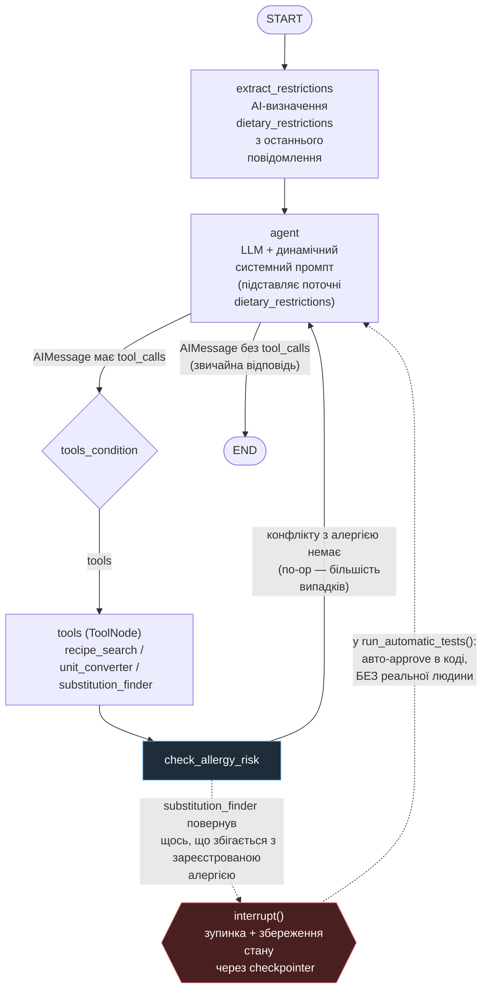
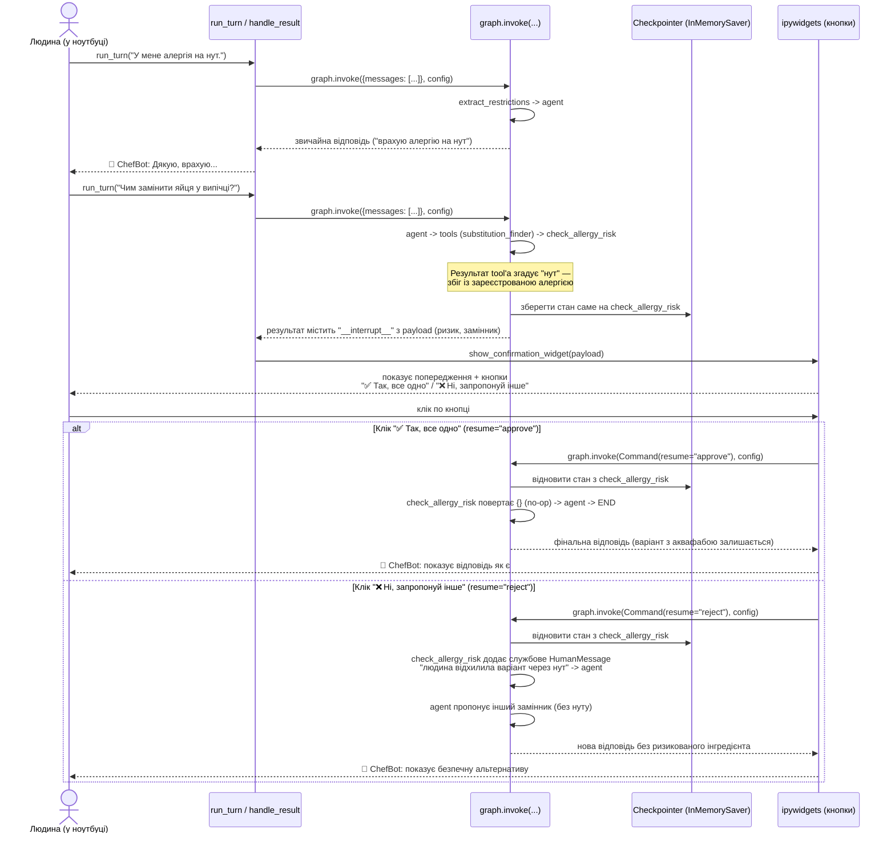

# Діаграми архітектури: ChefBot на LangGraph (Тема 9)

**Файл коду:** `yudbox_hw09_chef_bot.ipynb`
**Опис рішення:** `IMPLEMENTATION-PLAN-CHEFBOT-LANGGRAPH.md`

Два різні представлення однієї й тієї самої системи:

1. **Діаграма 1** — топологія графа станів (вузли й ребра), як він виконується в базовому/автоматичному
   режимі, коли немає живої людини, яка натискає кнопки.
2. **Діаграма 2** — послідовність подій під час реального human-in-the-loop: коли граф справді зупиняється
   і чекає на клік людини (демонстраційна комірка з `ipywidgets`).

Це не дві різні архітектури — механізм зупинки (`interrupt()`/`Command(resume=...)`) один і той самий в
обох випадках. Різниця лише в тому, **хто** приймає рішення про продовження: реальна людина (діаграма 2)
чи код автотесту, що імітує підтвердження (примітка в діаграмі 1).

---

## Діаграма 1. Топологія графа (`StateGraph`) — базовий/автоматичний потік

**Як читати цю діаграму.** Суцільні лінії — звичайний, найчастіший шлях виконання (цикл ReAct:
агент викликає інструмент, отримує результат, вирішує викликати ще один або відповісти). Пунктирні лінії —
рідкісна гілка, що трапляється, лише коли `substitution_finder` пропонує замінник, який конфліктує з
зареєстрованою алергією користувача. У режимі автоматичного тестування (`run_automatic_tests`) ця гілка,
навіть якщо активується, не чекає жодної людини — код одразу сам підтверджує продовження, щоб тест міг
завершитися без втручання. Реальне очікування людини показане окремо, у діаграмі 2.

---

## Діаграма 2. Human-in-the-loop із реальним підтвердженням людини

Ця послідовність відповідає комірці `hitl_config` / демонстрації з кнопками `ipywidgets` у ноутбуці:
користувач спершу повідомляє про алергію на нут, потім просить замінник для яєць — один із варіантів у
базі (аквафаба) якраз готується з нуту.

**Ключова відмінність від діаграми 1.** Тут кроки «UI показує кнопки» і «Ви клікаєте» — реальні, з паузою
невизначеної тривалості (граф технічно "заморожений" між `interrupt()` і моментом кліка). У режимі
автотестування ця пауза відсутня: замість блоку `alt` з реальним вибором людини код одразу і безумовно йде
шляхом `resume="approve"`.
